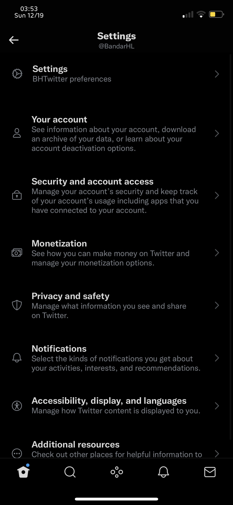
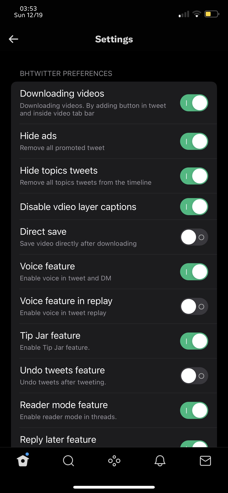
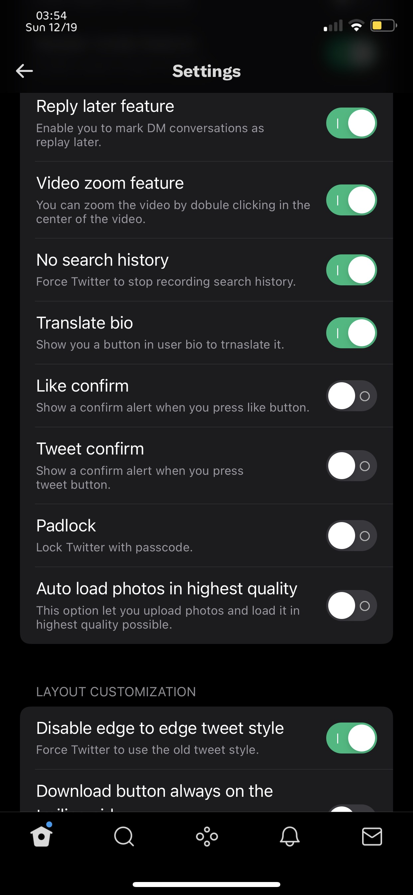
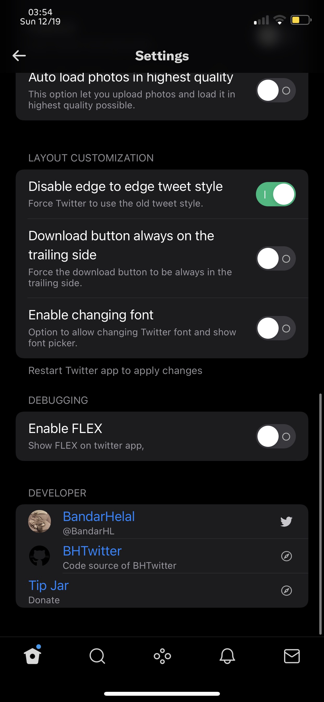

# BHTwitter

An awesome tweak for Twitter that enhances your experience with additional features and customization options. Get rid of ads, gain access to Twitter Blue features for free and much much more! 

## 🧩 Features
*Please note that we heavily rely on feature flags. If a feature doesn't work anymore, it's beacuse Twitter most likely removed support for it.*

###  General Enhancements 
- Download videos (even from private accounts)
- Load photos in highest quality available
- Save Tweets as images
- Undo Tweet
- Enable voice Tweets & voice messages in DM
- Enable new DM search UI

###  UI Customization
- Custom tab bar
- Themes (like Twitter Blue)
- App icon changer
- Font changer
- Padlock
- Disable edge-to-edge Tweet style
- Always open in Safari
- Hide Spaces bar
- Hide topics Tweets
- No history feature
- Disable RTL (Right-To-Left)
- Disable video layer caption

###  Interaction & Behavior
- Twitter Circle feature
- Copy profile information
- Translate bio
- Confirm alerts on:
  - Tweet
  - Like
  - Follow

###  Developer Tools
- FLEX debugging tool


## 📸 Screenshots

|  |  |  |
|:----------:|:----------:|:----------:|
|  |


## 🛠 Building BHTwitter

###  Local Setup

1. Install [Theos](https://github.com/theos/theos)
2. Install [cyan](https://github.com/asdfzxcvbn/pyzule-rw) (for sideload or TrollStore builds)

```bash
git clone --recursive https://github.com/BandarHL/BHTwitter
cd BHTwitter
chmod +x ./build.sh
./build.sh [OPTIONS]
```

#### Options:
- `--rootfull` : Build for rootfull deployment
- `--rootless` : Build for rootless deployment
- `--trollstore` : Build for TrollStore deployment
- *(No option)* or `--sideloaded` : Build for sideloaded deployment 


###  GitHub Actions

1. Fork this repository
2. Enable workflows in the **Actions** tab
3. Select the **Build and Release BHTwitter** workflow
4. Input required parameters and run the workflow
   - Choose deployment type (`rootfull`, `rootless`, `sideloaded`, `trollstore`)
   - For sideloaded/trollstore: provide a valid URL to decrypted IPA
   - For rootfull/rootless: any value works


## 🚀 Examples

###  Sideloaded
```bash
# Place your IPA file in the packages folder. It needs to be named "com.atebits.Tweetie2.ipa"
# Then run

./build.sh --sideloaded
# You'll get BHTwitter-sideloaded.ipa in the packages folder.
```

###  TrollStore
```bash
# Place your IPA file in the packages folder. It needs to be named "com.atebits.Tweetie2.ipa"
# Then run

./build.sh --trollstore
# You'll get BHTwitter-trollstore.ipa in the packages folder.
```

###  Rootless
```bash
# Simply run

./build.sh --rootless
# You'll get: com.bandarhl.bhTwitter_4.2_iphoneos-arm64.deb
```

###  Rootfull
```bash
# Simply run

./build.sh --rootfull
# You'll get: com.bandarhl.bhTwitter_4.2_iphoneos-arm.deb
```
